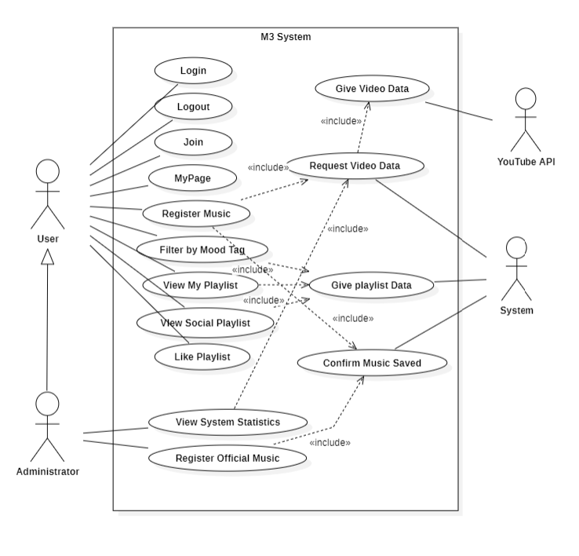
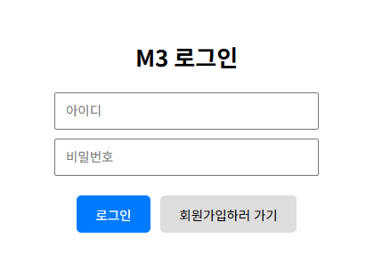
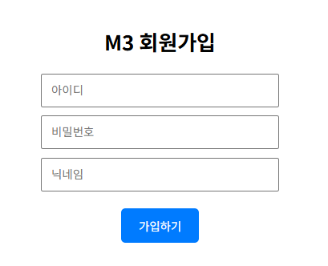
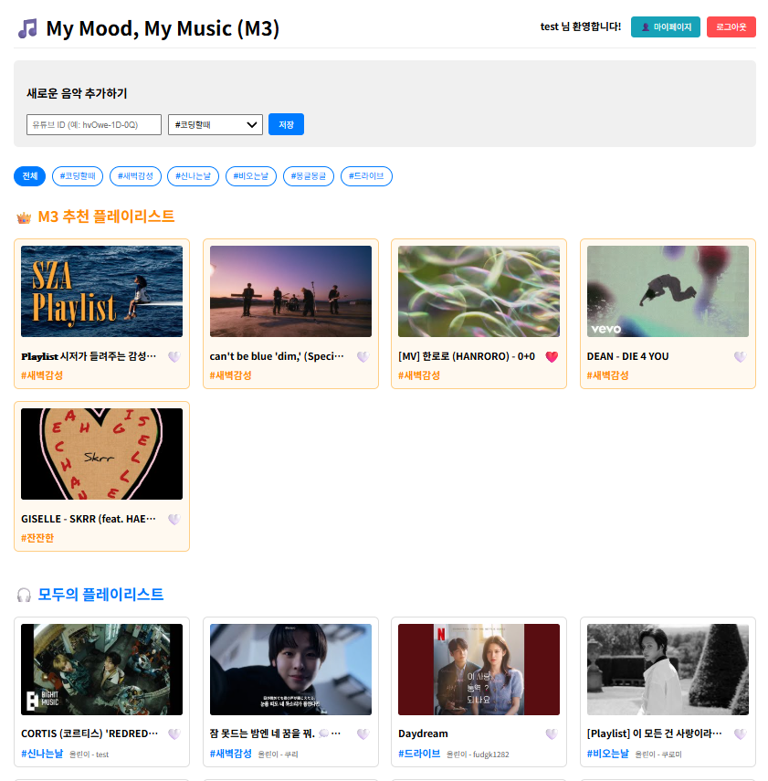
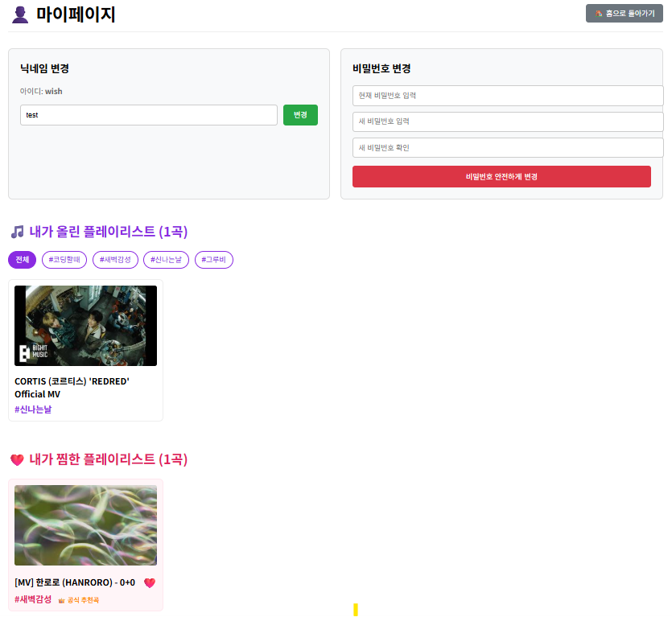
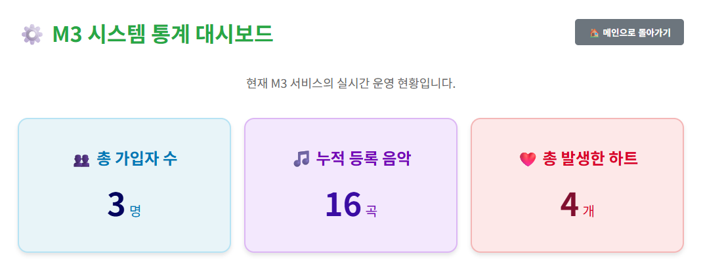

# Analysis 
22212010 김령하
## 🎵 My Mood, My Music (M3)🎵  

## [ Revision history ]

| Revision date | Version # | Description | Author |
| :--- | :--- | :--- | :--- |
| 2026.05.06 | 1.0.0 | 초안 작성 | 김령하 |

---

## = Contents =

1. Introduction
2. Use case analysis
3. Domain analysis
4. User Interface prototype
5. Glossary
6. References

---

## 1. Introduction

### 1) Executive Summary
음악은 현대인의 일상에서 빠져서는 안 될 필수 요소이다. 그러나 매번 현재 기분이나 상황에 꼭 맞는 곡을 찾기란 쉽지 않으며, 기존 대형 플랫폼의 추천 알고리즘은 청취 이력이나 대중 인기도 위주라 즉각적인 반영에 한계가 있다. 이러한 불편을 해소하고자 유튜브 기반의 태그형 맞춤 음악 큐레이션 웹 서비스 'My Mood, My Music (M3)'를 설계하였다.

### 2) Describe the features of project
M3는 이용자가 직접 유튜브 Video ID와 감성 태그를 등록하고, 태그 필터로 그날의 무드에 맞는 음악을 즉시 찾고, 감상할 수 있는 서비스이다. 주요 기능으로는 회원 관리, 음악 등록, 태그 필터링, 소셜 플레이리스트 공유, 좋아요 기능, 관리자 공식 추천 플레이리스트 관리, 시스템 통계 대시보드가 있다.

---

## 2. Use case analysis

### 2.1. Use Case Diagram
다이어그램 삽입

본 다이어그램은 User, Administrator, System, YouTube API 4개의 액터와 15개의 유스케이스로 구성되며, «include» 관계를 통해 핵심 기능 간 의존 관계를 표현한다.

| Use Case Name | Use Case ID | Actor |
| :--- | :--- | :--- |
| Login | #1 | User, Administrator |
| Logout | #2 | User, Administrator |
| Join | #3 | User, Administrator |
| Mypage | #4 | User |
| Register Music | #5 | User |
| Filter by Mood Tag | #6 | User |
| View My Playlist | #7 | User |
| View Social Playlist | #8 | User |
| Like Playlist | #9 | User |
| Confirm Music Saved | #10 | System |
| Give Playlist Data | #11 | System |
| Request Video Data | #12 | System |
| Give Video Data | #13 | YouTube API |
| View System Statistics | #14 | Administrator |
| Register Official Music | #15 | Administrator |

---

### 2.2. Use Case Description

#### 2.2.1. Login

| Use Case #1 :Login | |
| :--- | :--- |
| **GENERAL CHARACTERISTICS** | |
| Summary | 이용자와 관리자가 자신의 계정으로 시스템에 로그인한다. |
| Scope | My Mood, My Music (M3) |
| Level | User level |
| Author | |
| Last Update | 2026.05 |
| Status | Analysis |
| Primary Actor | User, Administrator |
| Secondary Actors | System |
| Preconditions | 회원가입을 완료한 상태이다. |
| Trigger | 로그인 화면에서 아이디와 비밀번호를 입력하고 로그인 버튼을 클릭했을 때. |
| Success Post Condition | DB에 저장된 회원임이 확인되면 메인 홈 화면으로 이동하고 환영 메시지를 출력한다. |
| Failed Post Condition | 아이디 또는 비밀번호가 틀리면 로그인에 실패하고 오류 메시지를 출력한다. |
| **MAIN SUCCESS SCENARIO** | |
| **Step** | **Action** |
| S | 이용자 또는 관리자가 시스템에 로그인하려 한다. |
| 1 | 로그인 화면에 접속한다. |
| 2 | 아이디와 비밀번호를 입력한다. |
| 3 | 로그인 버튼을 클릭한다. |
| 4 | 시스템이 DB에서 해당 계정 정보를 조회하고 비밀번호를 대조한다. |
| 5 | 인증 성공 시 사용자 정보를 localStorage에 저장하고 홈 화면으로 이동한다. |
| **EXTENSION SCENARIOS** | |
| **Step** | **Branching Action** |
| 4 | 4a. 아이디가 존재하지 않는 경우 → '존재하지 않는 아이디입니다.' 메시지를 출력한다. 4b. 비밀번호가 틀린 경우 → '비밀번호가 일치하지 않습니다.' 메시지를 출력한다. |
| **RELATED INFORMATION** | |
| Performance | ≦ 3 Seconds |
| Frequency | Variable |
| Concurrency | None |
| Due Date | |

#### 2.2.2. Logout

| Use Case #2 : Logout | |
| :--- | :--- |
| **GENERAL CHARACTERISTICS** | |
| Summary | 이용자와 관리자가 자신의 계정으로 시스템에서 로그아웃한다. |
| Scope | My Mood, My Music (M3) |
| Level | User level |
| Author | |
| Last Update | 2026.05 |
| Status | Analysis |
| Primary Actor | User, Administrator |
| Secondary Actors | System |
| Preconditions | 로그인된 상태이다. |
| Trigger | 로그아웃 버튼을 눌렀을 때. |
| Success Post Condition | 정상적으로 로그아웃이 된다. |
| Failed Post Condition | 버튼이 제대로 눌러지지 않았을 경우. |
| **MAIN SUCCESS SCENARIO** | |
| **Step** | **Action** |
| S | 사용을 종료하기 위해 로그아웃을 하려 한다. |
| 1 | 로그아웃 버튼을 누른다. |
| 2 | 정상적으로 로그아웃 처리가 되면 로그인 화면으로 이동한다. |
| **EXTENSION SCENARIOS** | |
| **Step** | **Branching Action** |
| 1 | 1a. 버튼이 제대로 눌리지 않았을 경우 → 로그아웃 실패 |
| **RELATED INFORMATION** | |
| Performance | ≦ 3 Seconds |
| Frequency | Variable |
| Concurrency | None |
| Due Date | |

#### 2.2.3. Join

| Use Case #3 : Join | |
| :--- | :--- |
| **GENERAL CHARACTERISTICS** | |
| Summary | 새로운 이용자(또는 최초 관리자)가 자신의 계정 정보를 등록한다. |
| Scope | My Mood, My Music (M3) |
| Level | User level |
| Author | |
| Last Update | 2026.05 |
| Status | Analysis |
| Primary Actor | User, Administrator |
| Secondary Actors | System |
| Preconditions | 시스템이 실행되어 있어야 한다. |
| Trigger | 로그인 화면에서 '회원가입하러 가기' 버튼을 클릭했을 때. |
| Success Post Condition | 아이디·닉네임 중복 없이 정보를 입력하면 DB에 저장되고 로그인 화면으로 이동한다. |
| Failed Post Condition | 아이디 또는 닉네임이 이미 존재하는 경우 가입에 실패하고 오류 메시지를 출력한다. |
| **MAIN SUCCESS SCENARIO** | |
| **Step** | **Action** |
| S | 이용자가 서비스를 처음 이용하려 한다. |
| 1 | 로그인 화면에서 '회원가입하러 가기' 버튼을 클릭한다. |
| 2 | 회원가입 화면에서 아이디, 비밀번호, 닉네임을 입력한다. |
| 3 | '가입하기' 버튼을 클릭한다. |
| 4 | 시스템이 아이디·닉네임 중복 여부를 DB에서 검사한다. |
| 5 | 중복이 없으면 User 테이블에 저장하고 로그인 화면으로 이동한다. |
| **EXTENSION SCENARIOS** | |
| **Step** | **Branching Action** |
| 4 | 4a. 이미 존재하는 아이디인 경우 → '이미 존재하는 아이디입니다.' 출력 후 가입 화면 유지. 4b. 이미 사용 중인 닉네임인 경우 → '이미 사용 중인 닉네임입니다.' 출력 후 가입 화면 유지. |
| **RELATED INFORMATION** | |
| Performance | ≦ 3 Seconds |
| Frequency | Variable |
| Concurrency | None |
| Due Date | |

#### 2.2.4. Mypage

| Use Case #4 : Mypage | |
| :--- | :--- |
| **GENERAL CHARACTERISTICS** | |
| Summary | 이용자는 자신의 닉네임·비밀번호를 변경하고 자신이 올린 플레이리스트와 찜한 플레이리스트 목록을 확인할 수 있다. |
| Scope | My Mood, My Music (M3) |
| Level | User level |
| Author | |
| Last Update | 2026.05 |
| Status | Analysis |
| Primary Actor | User |
| Secondary Actors | System |
| Preconditions | 로그인이 완료된 상태이다. |
| Trigger | 홈 화면 상단의 '마이페이지' 버튼을 클릭했을 때. |
| Success Post Condition | 마이페이지 화면에 닉네임 변경 폼, 비밀번호 변경 폼, 내가 올린 플레이리스트, 내가 찜한 플레이리스트가 표시된다. |
| Failed Post Condition | 로그인이 되어 있지 않으면 로그인 화면으로 리다이렉트된다. |
| **MAIN SUCCESS SCENARIO** | |
| **Step** | **Action** |
| S | 이용자가 정보를 수정하거나 플레이리스트를 모아보려 한다. |
| 1 | 홈 화면 상단의 '마이페이지' 버튼을 클릭한다. |
| 2 | 시스템이 로그인 여부를 확인한다. |
| 3 | 닉네임 변경: 새 닉네임 입력 후 '변경' 버튼 클릭 → 중복 확인 후 DB 업데이트. |
| 4 | 비밀번호 변경: 현재 비밀번호, 새 비밀번호, 새 비밀번호 확인 입력 후 변경 버튼 클릭. |
| 5 | 내가 올린 플레이리스트와 내가 찜한 플레이리스트를 각각 렌더링한다. |
| **EXTENSION SCENARIOS** | |
| **Step** | **Branching Action** |
| 3 | 3a. 변경하려는 닉네임이 이미 사용 중인 경우 → '이미 사용 중인 닉네임 입니다.' 출력. |
| 4 | 4a. 현재 비밀번호 불일치 → '현재 비밀번호가 일치하지 않습니다.' 출력. 4b. 새 비밀번호와 확인이 다른 경우 → '새 비밀번호와 비밀번호 확인이 일치하지 않습니다.' 출력. |
| **RELATED INFORMATION** | |
| Performance | ≦ 3 Seconds |
| Frequency | Variable |
| Concurrency | None |
| Due Date | |

#### 2.2.5. Register Music

| Use Case #5 : Register Music | |
| :--- | :--- |
| **GENERAL CHARACTERISTICS** | |
| Summary | 이용자가 유튜브 Video ID와 감성 태그를 입력하여 음악 등록 요청을 한다. |
| Scope | My Mood, My Music (M3) |
| Level | User level |
| Author | |
| Last Update | 2026.05 |
| Status | Analysis |
| Primary Actor | User |
| Secondary Actors | System, YouTubeService |
| Preconditions | 로그인이 완료된 상태이다. |
| Trigger | 홈 화면에서 유튜브 ID 입력, 태그를 선택한 후 '저장' 버튼을 클릭했을 때. |
| Success Post Condition | 유튜브 API에서 제목·썸네일을 받아와 Music 테이블에 저장되고 플레이리스트가 즉시 갱신된다. |
| Failed Post Condition | 유효하지 않은 Video ID이거나 API 오류 발생 시 저장에 실패하고 오류 메시지를 출력한다. |
| **MAIN SUCCESS SCENARIO** | |
| **Step** | **Action** |
| S | 이용자가 원하는 음악을 플레이리스트에 추가하려 한다. |
| 1 | 홈 화면 상단의 음악 추가 영역에서 유튜브 Video ID를 입력한다. |
| 2 | 드롭다운에서 감성 태그를 선택하거나 직접 입력한다. |
| 3 | '저장' 버튼을 클릭한다. |
| 4 | 시스템이 YouTubeService를 통해 YouTube Data API v3에 영상 정보를 요청한다. |
| 5 | API 응답에서 제목과 썸네일 URL을 추출한다. |
| 6 | Music 테이블에 videoId, title, moodTag, loginId, nickname을 저장한다. |
| 7 | 저장 성공 알림을 표시하고 플레이리스트를 새로고침한다. |
| **EXTENSION SCENARIOS** | |
| **Step** | **Branching Action** |
| 1 | 1a. Video ID를 입력하지 않은 경우 → '유튜브 ID를 입력해주세요!' 출력. |
| 4 | 4a. YouTube API에서 영상을 찾을 수 없는 경우 → '유효하지 않은 Video ID입니다.' 출력. 4b. API 키 오류 또는 쿼터 초과 → '저장에 실패했습니다.' 출력. |
| **RELATED INFORMATION** | |
| Performance | ≦ 3 Seconds |
| Frequency | Variable |
| Concurrency | None |
| Due Date | |

#### 2.2.6. Filter by Mood Tag

| Use Case #6 : Filter by Mood Tag | |
| :--- | :--- |
| **GENERAL CHARACTERISTICS** | |
| Summary | 이용자가 원하는 태그 버튼을 클릭하면 해당 태그와 일치하는 M3 추천 음악만 필터링하여 보여준다. |
| Scope | My Mood, My Music (M3) |
| Level | User level |
| Author | |
| Last Update | 2026.05 |
| Status | Analysis |
| Primary Actor | User |
| Secondary Actors | System |
| Preconditions | 로그인이 완료된 상태이고 홈 화면 상태이다. |
| Trigger | 홈 화면 상단의 태그 필터 버튼을 클릭했을 때. |
| Success Post Condition | 선택한 태그와 일치하는 M3 추천 플레이리스트만 화면에 렌더링된다. |
| Failed Post Condition | 해당 태그의 등록된 곡이 없으면 '해당 태그의 공식 추천곡이 없습니다.' 메시지를 출력한다. |
| **MAIN SUCCESS SCENARIO** | |
| **Step** | **Action** |
| S | 이용자가 특정 음악만 보고 싶어 한다. |
| 1 | 홈 화면 상단의 태그 버튼 중 하나를 클릭한다. |
| 2 | 시스템이 현재 로드된 음악 목록에서 선택한 태그와 일치하는 곡만 필터링한다. |
| 3 | 필터링된 결과를 'M3 추천 플레이리스트' 영역에 렌더링한다. |
| 4 | '전체' 버튼 클릭 시 필터 해제 후 전체 M3 추천 곡을 표시한다. |
| **EXTENSION SCENARIOS** | |
| **Step** | **Branching Action** |
| 3 | 3a. 선택한 태그에 해당하는 곡이 없는 경우 → '해당 태그의 공식 추천곡이 없습니다.' 출력. |
| **RELATED INFORMATION** | |
| Performance | ≦ 3 Seconds |
| Frequency | Variable |
| Concurrency | None |
| Due Date | |

#### 2.2.7. View My Playlist

| Use Case #7 : View My Playlist | |
| :--- | :--- |
| **GENERAL CHARACTERISTICS** | |
| Summary | 이용자가 직접 등록한 플레이리스트를 마이페이지에서 조회하고 태그별로 필터링할 수 있다. |
| Scope | My Mood, My Music (M3) |
| Level | User level |
| Author | |
| Last Update | 2026.05 |
| Status | Analysis |
| Primary Actor | User |
| Secondary Actors | System |
| Preconditions | 로그인이 완료된 상태이고 마이페이지 상태이다. |
| Trigger | 마이페이지에 접속했을 때 또는 태그 필터 버튼을 클릭했을 때. |
| Success Post Condition | 자신의 loginId로 등록된 음악 목록이 표시되고 태그 필터가 동작한다. |
| Failed Post Condition | 등록한 곡이 없거나 필터에 맞는 곡이 없으면 '해당 태그에 등록한 내 음악이 없습니다.' 안내 메시지가 출력된다. |
| **MAIN SUCCESS SCEN# My Mood, My Music (M3)
## -Analysis-

---

## [ Revision history ]

| Revision date | Version # | Description | Author |
| :--- | :--- | :--- | :--- |
| 2026.05.06 | 1.0.0 | 초안 작성 | 김령하 |

---

## = Contents =

1. Introduction ... 4
2. Use case analysis ... 5
3. Domain analysis ... 23
4. User Interface prototype ... 30
5. Glossary ... 38
6. References ... 39

---

## 1. Introduction

### 1) Executive Summary
음악은 현대인의 일상에서 빠져서는 안 될 필수 요소이다. 그러나 매번 현재 기분이나 상황에 꼭 맞는 곡을 찾기란 쉽지 않으며, 기존 대형 플랫폼의 추천 알고리즘은 청취 이력이나 대중 인기도 위주라 즉각적인 반영에 한계가 있다. 이러한 불편을 해소하고자 유튜브 기반의 태그형 맞춤 음악 큐레이션 웹 서비스 'My Mood, My Music (M3)'를 설계하였다.

### 2) Describe the features of project
M3는 이용자가 직접 유튜브 Video ID와 감성 태그를 등록하고, 태그 필터로 그날의 무드에 맞는 음악을 즉시 찾고, 감상할 수 있는 서비스이다. 주요 기능으로는 회원 관리, 음악 등록, 태그 필터링, 소셜 플레이리스트 공유, 좋아요 기능, 관리자 공식 추천 플레이리스트 관리, 시스템 통계 대시보드가 있다.

---

## 2. Use case analysis

### 2.1. Use Case Diagram

아래 그림은 M3 시스템의 Use Case Diagram이다.

> 📌 **이미지 삽입 방법:** 위 경로(`./images/use_case_diagram.png`)에 실제 다이어그램 이미지를 저장하면 GitHub에서 자동으로 렌더링됩니다. 자세한 방법은 문서 하단 안내를 참고하세요.

본 다이어그램은 User, Administrator, System, YouTube API 4개의 액터와 15개의 유스케이스로 구성되며, «include» 관계를 통해 핵심 기능 간 의존 관계를 표현한다.

| Use Case Name | Use Case ID | Korean Name | Actor |
| :--- | :--- | :--- | :--- |
| Login | #1 | 로그인 | User, Administrator |
| Logout | #2 | 로그아웃 | User, Administrator |
| Join | #3 | 회원가입 | User, Administrator |
| Mypage | #4 | 마이페이지 | User |
| Register Music | #5 | 음악 등록 | User |
| Filter by Mood Tag | #6 | 태그별 음악 필터링 | User |
| View My Playlist | #7 | 내 플레이리스트 조회 | User |
| View Social Playlist | #8 | 소셜 플레이리스트 조회 | User |
| Like Playlist | #9 | 플레이리스트 좋아요 | User |
| Confirm Music Saved | #10 | 음악 저장 성공 알림 | System |
| Give Playlist Data | #11 | 플레이리스트 데이터 제공 | System |
| Request Video Data | #12 | 영상 데이터 요청 | System |
| Give Video Data | #13 | 영상 데이터 전달 | YouTube API |
| View System Statistics | #14 | 시스템 통계 조회 | Administrator |
| Register Official Music | #15 | 공식 음악 등록 | Administrator |

---

### 2.2. Use Case Description

#### 2.2.1. Login

| Use Case #1 : Login | |
| :--- | :--- |
| **GENERAL CHARACTERISTICS** | |
| Summary | 이용자와 관리자가 자신의 계정으로 시스템에 로그인한다. |
| Scope | My Mood, My Music (M3) |
| Level | User level |
| Author | |
| Last Update | 2026.05 |
| Status | Analysis |
| Primary Actor | User, Administrator |
| Secondary Actors | System |
| Preconditions | 회원가입을 완료한 상태이다. |
| Trigger | 로그인 화면에서 아이디와 비밀번호를 입력하고 로그인 버튼을 클릭했을 때. |
| Success Post Condition | DB에 저장된 회원임이 확인되면 메인 홈 화면으로 이동하고 환영 메시지를 출력한다. |
| Failed Post Condition | 아이디 또는 비밀번호가 틀리면 로그인에 실패하고 오류 메시지를 출력한다. |
| **MAIN SUCCESS SCENARIO** | |
| **Step** | **Action** |
| S | 이용자 또는 관리자가 시스템에 로그인하려 한다. |
| 1 | 로그인 화면에 접속한다. |
| 2 | 아이디와 비밀번호를 입력한다. |
| 3 | 로그인 버튼을 클릭한다. |
| 4 | 시스템이 DB에서 해당 계정 정보를 조회하고 비밀번호를 대조한다. |
| 5 | 인증 성공 시 사용자 정보를 localStorage에 저장하고 홈 화면으로 이동한다. |
| **EXTENSION SCENARIOS** | |
| **Step** | **Branching Action** |
| 4 | 4a. 아이디가 존재하지 않는 경우 → '존재하지 않는 아이디입니다.' 메시지를 출력한다. 4b. 비밀번호가 틀린 경우 → '비밀번호가 일치하지 않습니다.' 메시지를 출력한다. |
| **RELATED INFORMATION** | |
| Performance | ≦ 3 Seconds |
| Frequency | Variable |
| Concurrency | None |
| Due Date | |

#### 2.2.2. Logout

| Use Case #2 : Logout | |
| :--- | :--- |
| **GENERAL CHARACTERISTICS** | |
| Summary | 이용자와 관리자가 자신의 계정으로 시스템에서 로그아웃한다. |
| Scope | My Mood, My Music (M3) |
| Level | User level |
| Author | |
| Last Update | 2026.05 |
| Status | Analysis |
| Primary Actor | User, Administrator |
| Secondary Actors | System |
| Preconditions | 로그인된 상태이다. |
| Trigger | 로그아웃 버튼을 눌렀을 때. |
| Success Post Condition | 정상적으로 로그아웃이 된다. |
| Failed Post Condition | 버튼이 제대로 눌러지지 않았을 경우. |
| **MAIN SUCCESS SCENARIO** | |
| **Step** | **Action** |
| S | 사용을 종료하기 위해 로그아웃을 하려 한다. |
| 1 | 로그아웃 버튼을 누른다. |
| 2 | 정상적으로 로그아웃 처리가 되면 로그인 화면으로 이동한다. |
| **EXTENSION SCENARIOS** | |
| **Step** | **Branching Action** |
| 1 | 1a. 버튼이 제대로 눌리지 않았을 경우 → 로그아웃 실패 |
| **RELATED INFORMATION** | |
| Performance | ≦ 3 Seconds |
| Frequency | Variable |
| Concurrency | None |
| Due Date | |

#### 2.2.3. Join

| Use Case #3 : Join | |
| :--- | :--- |
| **GENERAL CHARACTERISTICS** | |
| Summary | 새로운 이용자(또는 최초 관리자)가 자신의 계정 정보를 등록한다. |
| Scope | My Mood, My Music (M3) |
| Level | User level |
| Author | |
| Last Update | 2026.05 |
| Status | Analysis |
| Primary Actor | User, Administrator |
| Secondary Actors | System |
| Preconditions | 시스템이 실행되어 있어야 한다. |
| Trigger | 로그인 화면에서 '회원가입하러 가기' 버튼을 클릭했을 때. |
| Success Post Condition | 아이디·닉네임 중복 없이 정보를 입력하면 DB에 저장되고 로그인 화면으로 이동한다. |
| Failed Post Condition | 아이디 또는 닉네임이 이미 존재하는 경우 가입에 실패하고 오류 메시지를 출력한다. |
| **MAIN SUCCESS SCENARIO** | |
| **Step** | **Action** |
| S | 이용자가 서비스를 처음 이용하려 한다. |
| 1 | 로그인 화면에서 '회원가입하러 가기' 버튼을 클릭한다. |
| 2 | 회원가입 화면에서 아이디, 비밀번호, 닉네임을 입력한다. |
| 3 | '가입하기' 버튼을 클릭한다. |
| 4 | 시스템이 아이디·닉네임 중복 여부를 DB에서 검사한다. |
| 5 | 중복이 없으면 User 테이블에 저장하고 로그인 화면으로 이동한다. |
| **EXTENSION SCENARIOS** | |
| **Step** | **Branching Action** |
| 4 | 4a. 이미 존재하는 아이디인 경우 → '이미 존재하는 아이디입니다.' 출력 후 가입 화면 유지. 4b. 이미 사용 중인 닉네임인 경우 → '이미 사용 중인 닉네임입니다.' 출력 후 가입 화면 유지. |
| **RELATED INFORMATION** | |
| Performance | ≦ 3 Seconds |
| Frequency | Variable |
| Concurrency | None |
| Due Date | |

#### 2.2.4. Mypage

| Use Case #4 : Mypage | |
| :--- | :--- |
| **GENERAL CHARACTERISTICS** | |
| Summary | 이용자는 자신의 닉네임·비밀번호를 변경하고 자신이 올린 플레이리스트와 찜한 플레이리스트 목록을 확인할 수 있다. |
| Scope | My Mood, My Music (M3) |
| Level | User level |
| Author | |
| Last Update | 2026.05 |
| Status | Analysis |
| Primary Actor | User |
| Secondary Actors | System |
| Preconditions | 로그인이 완료된 상태이다. |
| Trigger | 홈 화면 상단의 '마이페이지' 버튼을 클릭했을 때. |
| Success Post Condition | 마이페이지 화면에 닉네임 변경 폼, 비밀번호 변경 폼, 내가 올린 플레이리스트, 내가 찜한 플레이리스트가 표시된다. |
| Failed Post Condition | 로그인이 되어 있지 않으면 로그인 화면으로 리다이렉트된다. |
| **MAIN SUCCESS SCENARIO** | |
| **Step** | **Action** |
| S | 이용자가 정보를 수정하거나 플레이리스트를 모아보려 한다. |
| 1 | 홈 화면 상단의 '마이페이지' 버튼을 클릭한다. |
| 2 | 시스템이 로그인 여부를 확인한다. |
| 3 | 닉네임 변경: 새 닉네임 입력 후 '변경' 버튼 클릭 → 중복 확인 후 DB 업데이트. |
| 4 | 비밀번호 변경: 현재 비밀번호, 새 비밀번호, 새 비밀번호 확인 입력 후 변경 버튼 클릭. |
| 5 | 내가 올린 플레이리스트와 내가 찜한 플레이리스트를 각각 렌더링한다. |
| **EXTENSION SCENARIOS** | |
| **Step** | **Branching Action** |
| 3 | 3a. 변경하려는 닉네임이 이미 사용 중인 경우 → '이미 사용 중인 닉네임 입니다.' 출력. |
| 4 | 4a. 현재 비밀번호 불일치 → '현재 비밀번호가 일치하지 않습니다.' 출력. 4b. 새 비밀번호와 확인이 다른 경우 → '새 비밀번호와 비밀번호 확인이 일치하지 않습니다.' 출력. |
| **RELATED INFORMATION** | |
| Performance | ≦ 3 Seconds |
| Frequency | Variable |
| Concurrency | None |
| Due Date | |

#### 2.2.5. Register Music

| Use Case #5 : Register Music | |
| :--- | :--- |
| **GENERAL CHARACTERISTICS** | |
| Summary | 이용자가 유튜브 Video ID와 감성 태그를 입력하여 음악 등록 요청을 한다. |
| Scope | My Mood, My Music (M3) |
| Level | User level |
| Author | |
| Last Update | 2026.05 |
| Status | Analysis |
| Primary Actor | User |
| Secondary Actors | System, YouTubeService |
| Preconditions | 로그인이 완료된 상태이다. |
| Trigger | 홈 화면에서 유튜브 ID 입력, 태그를 선택한 후 '저장' 버튼을 클릭했을 때. |
| Success Post Condition | 유튜브 API에서 제목·썸네일을 받아와 Music 테이블에 저장되고 플레이리스트가 즉시 갱신된다. |
| Failed Post Condition | 유효하지 않은 Video ID이거나 API 오류 발생 시 저장에 실패하고 오류 메시지를 출력한다. |
| **MAIN SUCCESS SCENARIO** | |
| **Step** | **Action** |
| S | 이용자가 원하는 음악을 플레이리스트에 추가하려 한다. |
| 1 | 홈 화면 상단의 음악 추가 영역에서 유튜브 Video ID를 입력한다. |
| 2 | 드롭다운에서 감성 태그를 선택하거나 직접 입력한다. |
| 3 | '저장' 버튼을 클릭한다. |
| 4 | 시스템이 YouTubeService를 통해 YouTube Data API v3에 영상 정보를 요청한다. |
| 5 | API 응답에서 제목과 썸네일 URL을 추출한다. |
| 6 | Music 테이블에 videoId, title, moodTag, loginId, nickname을 저장한다. |
| 7 | 저장 성공 알림을 표시하고 플레이리스트를 새로고침한다. |
| **EXTENSION SCENARIOS** | |
| **Step** | **Branching Action** |
| 1 | 1a. Video ID를 입력하지 않은 경우 → '유튜브 ID를 입력해주세요!' 출력. |
| 4 | 4a. YouTube API에서 영상을 찾을 수 없는 경우 → '유효하지 않은 Video ID입니다.' 출력. 4b. API 키 오류 또는 쿼터 초과 → '저장에 실패했습니다.' 출력. |
| **RELATED INFORMATION** | |
| Performance | ≦ 3 Seconds |
| Frequency | Variable |
| Concurrency | None |
| Due Date | |

#### 2.2.6. Filter by Mood Tag

| Use Case #6 : Filter by Mood Tag | |
| :--- | :--- |
| **GENERAL CHARACTERISTICS** | |
| Summary | 이용자가 원하는 태그 버튼을 클릭하면 해당 태그와 일치하는 M3 추천 음악만 필터링하여 보여준다. |
| Scope | My Mood, My Music (M3) |
| Level | User level |
| Author | |
| Last Update | 2026.05 |
| Status | Analysis |
| Primary Actor | User |
| Secondary Actors | System |
| Preconditions | 로그인이 완료된 상태이고 홈 화면 상태이다. |
| Trigger | 홈 화면 상단의 태그 필터 버튼을 클릭했을 때. |
| Success Post Condition | 선택한 태그와 일치하는 M3 추천 플레이리스트만 화면에 렌더링된다. |
| Failed Post Condition | 해당 태그의 등록된 곡이 없으면 '해당 태그의 공식 추천곡이 없습니다.' 메시지를 출력한다. |
| **MAIN SUCCESS SCENARIO** | |
| **Step** | **Action** |
| S | 이용자가 특정 음악만 보고 싶어 한다. |
| 1 | 홈 화면 상단의 태그 버튼 중 하나를 클릭한다. |
| 2 | 시스템이 현재 로드된 음악 목록에서 선택한 태그와 일치하는 곡만 필터링한다. |
| 3 | 필터링된 결과를 'M3 추천 플레이리스트' 영역에 렌더링한다. |
| 4 | '전체' 버튼 클릭 시 필터 해제 후 전체 M3 추천 곡을 표시한다. |
| **EXTENSION SCENARIOS** | |
| **Step** | **Branching Action** |
| 3 | 3a. 선택한 태그에 해당하는 곡이 없는 경우 → '해당 태그의 공식 추천곡이 없습니다.' 출력. |
| **RELATED INFORMATION** | |
| Performance | ≦ 3 Seconds |
| Frequency | Variable |
| Concurrency | None |
| Due Date | |

#### 2.2.7. View My Playlist

| Use Case #7 : View My Playlist | |
| :--- | :--- |
| **GENERAL CHARACTERISTICS** | |
| Summary | 이용자가 직접 등록한 플레이리스트를 마이페이지에서 조회하고 태그별로 필터링할 수 있다. |
| Scope | My Mood, My Music (M3) |
| Level | User level |
| Author | |
| Last Update | 2026.05 |
| Status | Analysis |
| Primary Actor | User |
| Secondary Actors | System |
| Preconditions | 로그인이 완료된 상태이고 마이페이지 상태이다. |
| Trigger | 마이페이지에 접속했을 때 또는 태그 필터 버튼을 클릭했을 때. |
| Success Post Condition | 자신의 loginId로 등록된 음악 목록이 표시되고 태그 필터가 동작한다. |
| Failed Post Condition | 등록한 곡이 없거나 필터에 맞는 곡이 없으면 '해당 태그에 등록한 내 음악이 없습니다.' 안내 메시지가 출력된다. |
| **MAIN SUCCESS SCENARIO** | |
| **Step** | **Action** |
| S | 이용자가 자신이 등록한 음악 목록을 확인하려 한다. |
| 1 | 마이페이지에 접속한다. |
| 2 | 시스템이 loginid의 music list를 호출하여 해당 이용자의 음악 목록을 조회한다. |
| 3 | '내가 올린 플레이리스트' 영역에 목록을 렌더링한다. |
| 4 | 태그 필터 버튼 클릭 시 해당 태그에 맞게 필터링하여 표시한다. |
| **EXTENSION SCENARIOS** | |
| **Step** | **Branching Action** |
| 2 | 2a. 등록한 곡이 없는 경우 → 빈 목록 표시 (0곡). |
| 4 | 4a. 선택한 태그에 해당하는 곡이 없는 경우 → '해당 태그에 등록한 내 음악이 없습니다.' 출력. |
| **RELATED INFORMATION** | |
| Performance | ≦ 3 Seconds |
| Frequency | Variable |
| Concurrency | None |
| Due Date | |

#### 2.2.8. View Social Playlist

| Use Case #8 : View Social Playlist | |
| :--- | :--- |
| **GENERAL CHARACTERISTICS** | |
| Summary | 이용자가 다른 이용자들이 등록한 플레이리스트를 홈 화면에서 조회하여 새로운 음악을 발견할 수 있다. |
| Scope | My Mood, My Music (M3) |
| Level | User level |
| Author | |
| Last Update | 2026.05 |
| Status | Analysis |
| Primary Actor | User |
| Secondary Actors | System |
| Preconditions | 로그인이 완료된 상태이다. |
| Trigger | 홈 화면에 접속했을 때 또는 새로고침 시. |
| Success Post Condition | 관리자가 아닌 모든 이용자가 등록한 음악이 최신순으로 '모두의 플레이리스트' 영역에 표시된다. |
| Failed Post Condition | 등록된 곡이 없으면 '아직 등록된 소셜 추천곡이 없습니다.' 메시지를 출력한다. |
| **MAIN SUCCESS SCENARIO** | |
| **Step** | **Action** |
| S | 이용자가 다른 사람들의 플레이리스트를 둘러보려 한다. |
| 1 | 홈 화면에 접속한다. |
| 2 | 시스템이 전체 음악 목록을 조회한다. |
| 3 | loginId가 'admin'이 아닌 곡만 필터링하여 최신순으로 정렬한다. |
| 4 | '모두의 플레이리스트' 영역에 썸네일, 제목, 태그, 올린이 닉네임과 함께 렌더링한다. |
| **EXTENSION SCENARIOS** | |
| **Step** | **Branching Action** |
| 3 | 3a. 일반 이용자가 등록한 곡이 없는 경우 → '아직 등록된 소셜 추천곡이 없습니다.' 출력. |
| **RELATED INFORMATION** | |
| Performance | ≦ 3 Seconds |
| Frequency | Variable |
| Concurrency | None |
| Due Date | |

#### 2.2.9. Like Playlist

| Use Case #9 : Like Playlist | |
| :--- | :--- |
| **GENERAL CHARACTERISTICS** | |
| Summary | 마음에 드는 곡에 하트를 눌러 좋아요를 추가하거나 취소하며, 찜한 곡은 마이페이지에서 확인할 수 있다. |
| Scope | My Mood, My Music (M3) |
| Level | User level |
| Author | |
| Last Update | 2026.05 |
| Status | Analysis |
| Primary Actor | User |
| Secondary Actors | System |
| Preconditions | 로그인이 완료된 상태이다. |
| Trigger | 곡 카드의 하트 버튼을 클릭했을 때. |
| Success Post Condition | MusicLike 테이블에 레코드가 추가되거나 삭제되며 하트 색이 즉시 변경된다. |
| Failed Post Condition | 서버 오류 발생 시 좋아요가 반영되지 않고 콘솔에 오류 메시지를 출력한다. |
| **MAIN SUCCESS SCENARIO** | |
| **Step** | **Action** |
| S | 이용자가 마음에 드는 곡을 찜하려 한다. |
| 1 | 홈 화면 또는 마이페이지에서 곡 카드의 하트 아이콘을 클릭한다. |
| 2 | 시스템이 POST 요청을 보낸다. |
| 3 | 이미 좋아요가 된 곡이면 다시 한번 눌렀을 경우, MusicLike 레코드를 삭제한다. |
| 4 | 좋아요가 눌리지 않은 곡이면 MusicLike 레코드를 추가한다. |
| 5 | api를 재호출하여 하트 상태를 즉시 업데이트한다. |
| **EXTENSION SCENARIOS** | |
| **Step** | **Branching Action** |
| 2 | 2a. 서버 오류 발생 시 → 콘솔에 '좋아요 처리 실패' 로그 출력, UI는 변경되지 않음. |
| **RELATED INFORMATION** | |
| Performance | ≦ 3 Seconds |
| Frequency | Variable |
| Concurrency | None |
| Due Date | |

#### 2.2.10. Confirm Music Saved

| Use Case #10 : Confirm Music Saved | |
| :--- | :--- |
| **GENERAL CHARACTERISTICS** | |
| Summary | 음악 등록 요청이 성공적으로 완료되었음을 이용자에게 알림창으로 시각적으로 인지시킨다. |
| Scope | My Mood, My Music (M3) |
| Level | User level |
| Author | |
| Last Update | 2026.05 |
| Status | Analysis |
| Primary Actor | System |
| Secondary Actors | User |
| Preconditions | 이용자가 Register Music 유스케이스를 실행한 직후이다. |
| Trigger | 백엔드에서 Music 저장 성공 응답을 수신했을 때. |
| Success Post Condition | 화면에 '저장 성공!' 알림창이 표시되고 플레이리스트가 즉시 갱신된다. |
| Failed Post Condition | 저장에 실패하면 '저장에 실패했습니다.' 알림창을 표시한다. |
| **MAIN SUCCESS SCENARIO** | |
| **Step** | **Action** |
| S | 이용자가 새로운 음악을 시스템에 등록 요청한 직후이다. |
| 1 | 백엔드에서 DB 저장이 완료되면 응답을 반환한다. |
| 2 | 프론트엔드가 응답을 수신하고 '저장 성공!'을 표시한다. |
| 3 | 입력 필드를 초기화하고 목록을 갱신한다. |
| **EXTENSION SCENARIOS** | |
| **Step** | **Branching Action** |
| 1 | 1a. 저장 실패(400/500) 응답 수신 시 → '저장에 실패했습니다.' 출력. |
| **RELATED INFORMATION** | |
| Performance | ≦ 3 Seconds |
| Frequency | Variable |
| Concurrency | None |
| Due Date | |

#### 2.2.11. Give Playlist Data

| Use Case #11 : Give Playlist Data | |
| :--- | :--- |
| **GENERAL CHARACTERISTICS** | |
| Summary | 이용자 요청에 맞는 플레이리스트 데이터를 DB에서 조회하여 JSON 형태로 전달한다. |
| Scope | My Mood, My Music (M3) |
| Level | User level |
| Author | |
| Last Update | 2026.05 |
| Status | Analysis |
| Primary Actor | System |
| Secondary Actors | User |
| Preconditions | 이용자가 페이지를 이동하거나 데이터 조회를 요청한 상태이다. |
| Trigger | /api/music/all 또는 /api/music/list를 호출했을 때. |
| Success Post Condition | 조건에 맞는 음악 목록 데이터가 JSON 배열 형태로 전달된다. |
| Failed Post Condition | DB 오류 발생 시 500 Internal Server Error를 반환한다. |
| **MAIN SUCCESS SCENARIO** | |
| **Step** | **Action** |
| S | 페이지 로드 또는 갱신 요청이 발생한다. |
| 1 | 프론트엔드가 API 엔드포인트를 호출한다. |
| 2 | 요청을 수신하고 MusicRepository를 통해 DB를 조회한다. |
| 3 | 조회 결과를 JSON 배열로 직렬화하여 200 OK와 함께 반환한다. |
| 4 | 프론트엔드가 응답 데이터를 받아 상태를 업데이트하고 UI를 렌더링한다. |
| **EXTENSION SCENARIOS** | |
| **Step** | **Branching Action** |
| 2 | 2a. DB 연결 실패 시 → 500 Internal Server Error 반환. 2b. 조회 결과가 없는 경우 → 빈 배열([]) 반환. |
| **RELATED INFORMATION** | |
| Performance | ≦ 3 Seconds |
| Frequency | Variable |
| Concurrency | None |
| Due Date | |

#### 2.2.12. Request Video Data

| Use Case #12 : Request Video Data | |
| :--- | :--- |
| **GENERAL CHARACTERISTICS** | |
| Summary | 이용자가 입력한 Video ID의 제목과 썸네일 정보를 확보하기 위해 YouTube Data API v3에 요청한다. |
| Scope | My Mood, My Music (M3) |
| Level | User level |
| Author | |
| Last Update | 2026.05 |
| Status | Analysis |
| Primary Actor | System |
| Secondary Actors | YouTubeService |
| Preconditions | 이용자가 유효한 유튜브 Video ID를 입력하여 Register Music을 실행한 상태이다. |
| Trigger | MusicController의 saveMusic() 메서드가 YouTubeService.getVideoInfo()를 호출했을 때. |
| Success Post Condition | YouTube API 서버가 영상 제목과 썸네일 URL을 반환하고 MusicInfoDto에 담긴다. |
| Failed Post Condition | 유효하지 않은 Video ID이거나 API 키 오류 시 RuntimeException이 발생한다. |
| **MAIN SUCCESS SCENARIO** | |
| **Step** | **Action** |
| S | 이용자가 새로운 음악을 등록 요청하여 내부 로직이 자동으로 실행된다. |
| 1 | YouTubeService가 호출된다. |
| 2 | YouTube Data API v3 엔드포인트로 GET 요청 전송한다. |
| 3 | API 응답 JSON을 파싱하여 제목과 썸네일 URL을 추출한다. |
| 4 | MusicInfoDto를 생성하여 MusicController에 반환한다. |
| **EXTENSION SCENARIOS** | |
| **Step** | **Branching Action** |
| 3 | 3a. items 배열이 비어있는 경우 → RuntimeException 발생 및 저장 중단. 3b. API 키가 유효하지 않거나 쿼터 초과 → RuntimeException 발생. |
| **RELATED INFORMATION** | |
| Performance | ≦ 3 Seconds |
| Frequency | Variable |
| Concurrency | None |
| Due Date | |

#### 2.2.13. Give Video Data

| Use Case #13 : Give Video Data | |
| :--- | :--- |
| **GENERAL CHARACTERISTICS** | |
| Summary | YouTube API 서버가 요청받은 Video ID를 검증하고 해당 영상의 제목과 썸네일을 시스템에 반환한다. |
| Scope | My Mood, My Music (M3) |
| Level | User level |
| Author | |
| Last Update | 2026.05 |
| Status | Analysis |
| Primary Actor | YouTube API |
| Secondary Actors | System |
| Preconditions | 시스템이 YouTube Data API v3 서버로 유효한 요청을 전송한 상태이다. |
| Trigger | YouTubeService가 YouTube API로 GET 요청을 전송했을 때. |
| Success Post Condition | YouTube API가 영상 제목과 고화질 썸네일 URL을 JSON 형태로 반환한다. |
| Failed Post Condition | 유효하지 않은 Video ID 또는 API 키 오류 시 빈 items 배열 또는 오류 응답을 반환한다. |
| **MAIN SUCCESS SCENARIO** | |
| **Step** | **Action** |
| S | YouTube API 서버가 시스템으로부터 정상적인 데이터 요청을 수신한다. |
| 1 | 요청된 Video ID의 유효성을 검증한다. |
| 2 | 유효한 영상이면 title과 url을 추출한다. |
| 3 | JSON 응답 형태로 시스템에 반환한다. |
| **EXTENSION SCENARIOS** | |
| **Step** | **Branching Action** |
| 1 | 1a. Video ID가 유효하지 않은 경우 → 빈 응답 반환. 1b. API 키가 유효하지 않은 경우 → 403 Forbidden 오류 응답 반환. |
| **RELATED INFORMATION** | |
| Performance | ≦ 3 Seconds |
| Frequency | Variable |
| Concurrency | None |
| Due Date | |

#### 2.2.14. View System Statistics

| Use Case #14 : View System Statistics | |
| :--- | :--- |
| **GENERAL CHARACTERISTICS** | |
| Summary | 관리자가 총 가입자 수, 등록된 음악 수, 총 하트 수 통계를 대시보드 화면에서 확인한다. |
| Scope | My Mood, My Music (M3) |
| Level | User level |
| Author | |
| Last Update | 2026.05 |
| Status | Analysis |
| Primary Actor | Administrator |
| Secondary Actors | System |
| Preconditions | 관리자(admin) 계정으로 로그인한 상태이다. |
| Trigger | 홈 화면 상단의 '시스템 통계' 버튼을 클릭했을 때. |
| Success Post Condition | 총 가입자 수, 누적 등록 음악 수, 총 발생한 하트 수가 대시보드 카드로 표시된다. |
| Failed Post Condition | 관리자가 아닌 이용자가 /admin 경로 접근 시 홈으로 리다이렉트되고 접근 불가 알림이 출력된다. |
| **MAIN SUCCESS SCENARIO** | |
| **Step** | **Action** |
| S | 관리자가 서비스 운영 현황을 확인하려 한다. |
| 1 | 홈 화면 상단의 '시스템 통계' 버튼을 클릭한다. |
| 2 | 시스템이 로그인한 계정이 admin인지 확인한다. |
| 3 | API를 호출하여 통계 데이터를 요청한다. |
| 4 | AdminController가 userRepository, musicRepository, musicLikeRepository의 count()를 각각 집계한다. |
| 5 | totalUsers, totalMusic, totalLikes를 JSON으로 반환하고 대시보드에 표시한다. |
| **EXTENSION SCENARIOS** | |
| **Step** | **Branching Action** |
| 2 | 2a. admin이 아닌 계정으로 접근 시 → '접근 권한이 없습니다!' 알림 후 홈 이동. |
| 3 | 3a. API 호출 실패 시 → 콘솔에 '통계 데이터 불러오기 실패' 출력. |
| **RELATED INFORMATION** | |
| Performance | ≦ 3 Seconds |
| Frequency | Variable |
| Concurrency | None |
| Due Date | |

#### 2.2.15. Register Official Music

| Use Case #15 : Register Official Music | |
| :--- | :--- |
| **GENERAL CHARACTERISTICS** | |
| Summary | 관리자가 샘플 음악을 직접 등록하여 서비스 초기 이용자들에게 공식 추천 플레이리스트를 제공한다. |
| Scope | My Mood, My Music (M3) |
| Level | User level |
| Author | |
| Last Update | 2026.05 |
| Status | Analysis |
| Primary Actor | Administrator |
| Secondary Actors | System, YouTubeService |
| Preconditions | 관리자(admin) 계정으로 로그인한 상태이다. |
| Trigger | 홈 화면의 음악 추가 영역에서 Video ID와 태그를 입력한 후 '저장' 버튼을 클릭했을 때. |
| Success Post Condition | 관리자가 등록한 음악이 Music 테이블에 loginId='admin'으로 저장되고 'M3 추천 플레이리스트'에 표시된다. |
| Failed Post Condition | 유효하지 않은 Video ID 또는 API 오류 시 저장에 실패하고 오류 메시지가 출력된다. |
| **MAIN SUCCESS SCENARIO** | |
| **Step** | **Action** |
| S | 관리자가 공식 샘플 음악을 등록하려 한다. |
| 1 | 홈 화면의 음악 추가 영역에서 유튜브 Video ID와 감성 태그를 입력한다. |
| 2 | '저장' 버튼을 클릭한다. |
| 3 | 시스템이 YouTubeService를 통해 YouTube Data API v3에 영상 정보를 요청한다. |
| 4 | API 응답에서 제목과 썸네일 URL을 추출한다. |
| 5 | Music 테이블에 loginId='admin', nickname=null로 저장된다. |
| 6 | 저장된 곡은 홈 화면의 'M3 추천 플레이리스트' 영역에만 표시된다. |
| **EXTENSION SCENARIOS** | |
| **Step** | **Branching Action** |
| 3 | 3a. 유효하지 않은 Video ID → '저장에 실패했습니다.' 알림 표시. |
| 4 | 4a. 네트워크 오류 또는 API 쿼터 초과 → RuntimeException 발생, 저장 중단. |
| **RELATED INFORMATION** | |
| Performance | ≦ 3 Seconds |
| Frequency | Variable |
| Concurrency | None |
| Due Date | 2026-06-30 |

---

## 3. Domain analysis

아래 그림은 M3 시스템의 Domain Class Diagram이다.

각 클래스의 설명은 아래 표와 같다.

| 클래스명 | 설명 |
| :--- | :--- |
| **User** | 시스템에 가입한 이용자와 관리자의 계정 정보를 저장하는 클래스이다. loginId, password, nickname 속성을 가지며, DB의 USERS 테이블과 매핑된다. loginId가 'admin'인 경우 관리자로 취급된다. |
| **Music** | 이용자가 등록한 유튜브 음악 데이터를 저장하는 클래스이다. videoId, title, moodTag, loginId, nickname 속성을 가진다. loginId가 'admin'이면 관리자 추천 플레이리스트, 그 외는 소셜 플레이리스트에 분류된다. |
| **MusicLike** | 이용자가 특정 음악에 좋아요를 누른 기록을 저장하는 클래스이다. loginId와 musicId를 속성으로 가지며 토글 방식으로 동작한다. |
| **YouTubeService** | YouTube Data API v3와 통신하여 Video ID로부터 영상 제목과 썸네일 URL을 가져오는 서비스 클래스이다. |
| **MusicInfoDto** | YouTubeService가 YouTube API에서 가져온 영상 정보를 전달하기 위한 데이터 전송 객체이다. |
| **AdminStats** | 관리자 통계 대시보드에서 사용하는 데이터 클래스이다. totalUsers, totalMusic, totalLikes를 포함하며 AdminController를 통해 JSON으로 제공된다. |

---

## 4. User Interface Prototype

### 4.1. Login 화면

M3에 접속하면 가장 먼저 나타나는 화면이다.  아이디와 비밀번호를 입력하고 '로그인' 버튼을 클릭하면 DB 인증 후 홈 화면으로 이동한다.  아이디·비밀번호가 틀리면 해당 오류 메시지가 경고창으로 표시된다.  아직 계정이 없는 경우 '회원가입하러 가기' 버튼을 클릭하여 회원가입 화면으로 이동한다.

### 4.2. Join 화면

신규 이용자가 아이디, 비밀번호, 닉네임을 입력하여 가입하는 화면이다. 아이디와 닉네임은 중복이 불가하며 중복 시 오류 메시지가 표시된다.  가입 성공 시 '회원가입 성공! 로그인해주세요.' 안내 후 로그인 화면으로 이동한다

### 4.3. Home 화면

로그인 후 이용자가 가장 먼저 보게 되는 화면이다.  상단에는 마이페이지, 로그아웃 버튼이 있고 관리자에게는 '시스템 통계' 버튼이 추가로 표시된다.  음악 추가 영역에서 유튜브 Video ID와 감성 태그를 선택 또는 직접 입력하여 저장할 수 있다.  태그 필터 버튼으로 관리자 추천 플레이리스트를 필터링할 수 있다.  화면 하단에는 'M3 추천 플레이리스트'와 '모두의 플레이리스트'가 분리 표시된다.  각 음악 카드에서 하트를 클릭하여 좋아요를 토글할 수 있다.

### 4.4. MyPage 화면

이용자가 개인정보를 관리하고 자신의 플레이리스트를 모아볼 수 있는 화면이다. 닉네임 변경 폼과 비밀번호 변경 폼이 나란히 표시된다.  하단에는 내가 올린 플레이리스트와 내가 찜한 플레이리스트가 각각 그리드로 표시된다.  찜한 목록에서는 하트를 클릭하여 즉시 취소할 수 있다.  관리자가 올린 공식 추천곡은 '공식 추천곡' 배지로, 일반 이용자 곡은 '올린이 - 닉네임' 형식으로 표시된다.

### 4.5. Admin Stats 화면

관리자(admin) 계정으로 로그인한 경우에만 접근 가능한 시스템 통계 대시보드 화면이다.  총 가입자 수(admin 제외), 누적 등록 음악 수, 총 발생한 하트 수를 카드 형태로 나란히 표시한다.  일반 이용자가 /admin 경로에 직접 접근하면 접근 불가 알림 후 홈으로 리다이렉트된다.

## 5. Glossary

| 용어 | 설명 |
| :--- | :--- |
| **큐레이션** | 무수히 많은 정보 중 콘텐츠 목적에 따라 분류하고, 가치 있는 것을 선별하여 제공하는 서비스. |
| **Video ID** | 유튜브 영상 URL에 포함된 11자리의 고유 식별자. |
| **메타데이터** | 다른 데이터를 정의하고 기술하는 데이터, 다양한 형식의 다른 데이터의 내용 또는 구조를 설명하는 데이터.|
| **썸네일** | 웹 페이지 레이아웃 규격에 맞춰 축소된 형태의 영상 미리보기 이미지. |
| **토글** | 하나의 조작으로 두 가지 상태를 번갈아 가며 전환하는 인터페이스 제어 방식. |
| **렌더링** | 서버로부터 받아온 데이터를 사용자가 시각적으로 확인할 수 있도록 웹 브라우저 화면에 그려내는 과정. |
| **영속성**| 서버가 종료되거나 재시작되더라도, 사용자가 등록한 데이터가 소멸하지 않고 데이터베이스에 안전하게 유지되는 성질. |

---

## 6. References

1. Google Developers. "YouTube Data API v3 Overview"
2. 네이버 지식백과 (IT용어사전)
