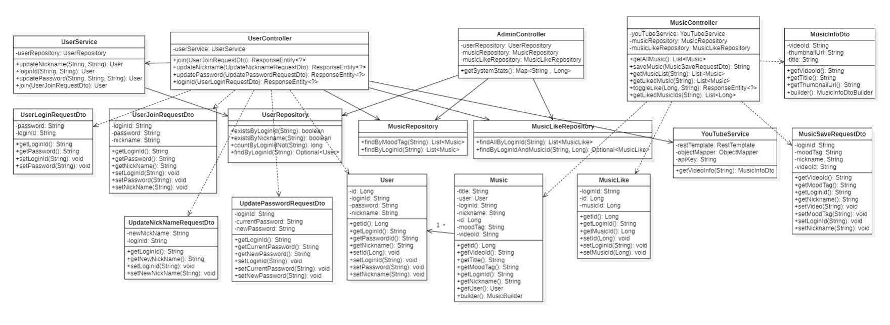
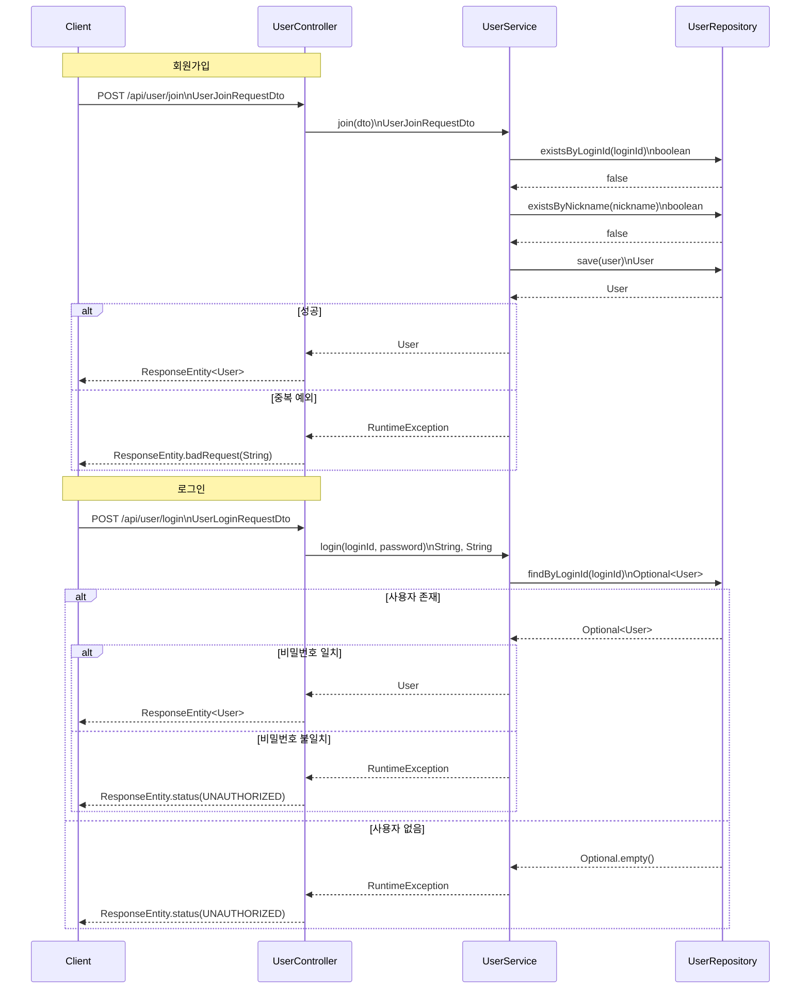
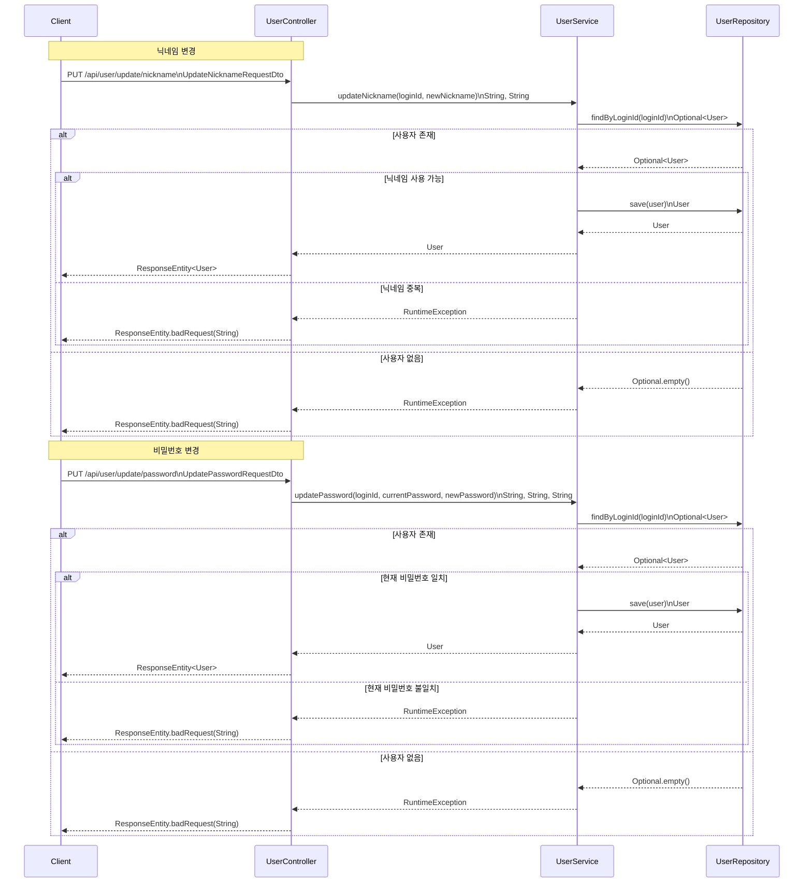
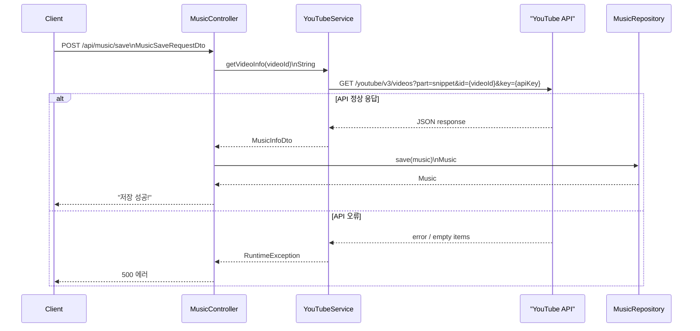
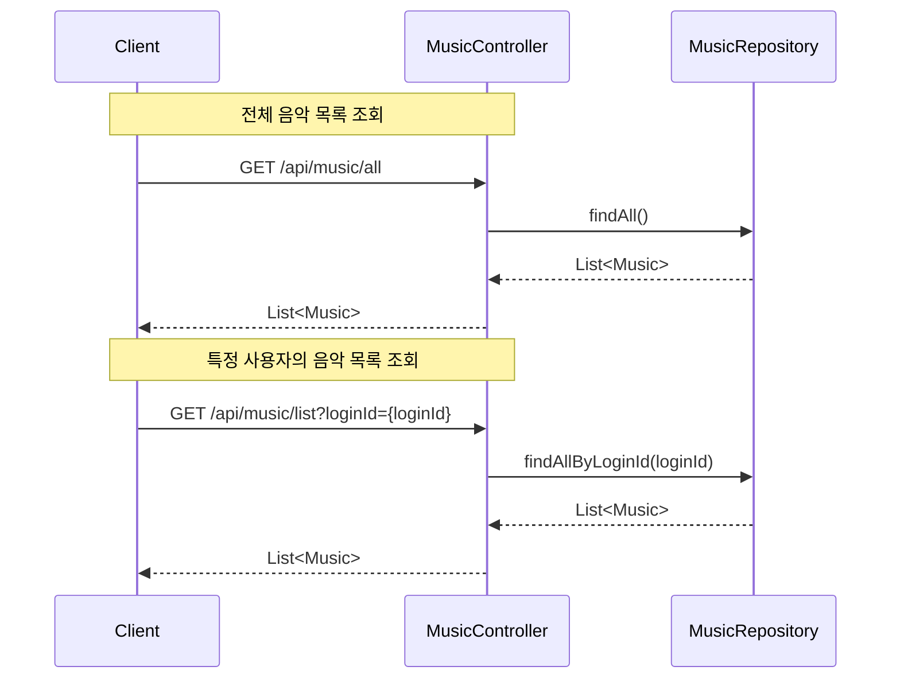
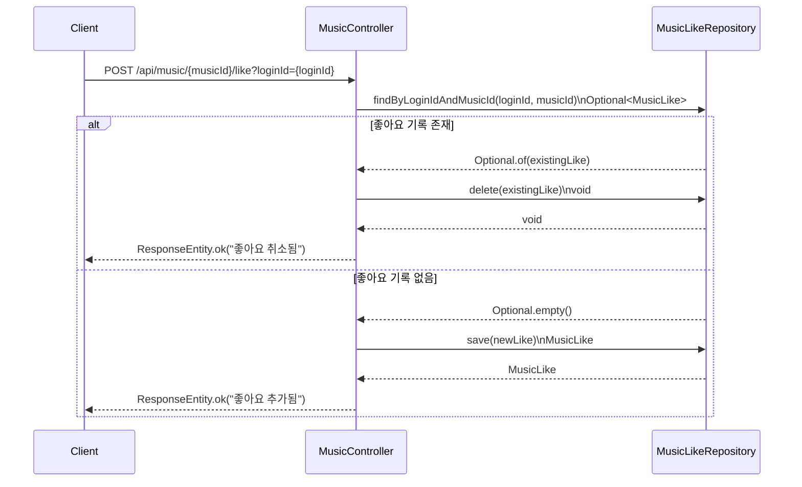
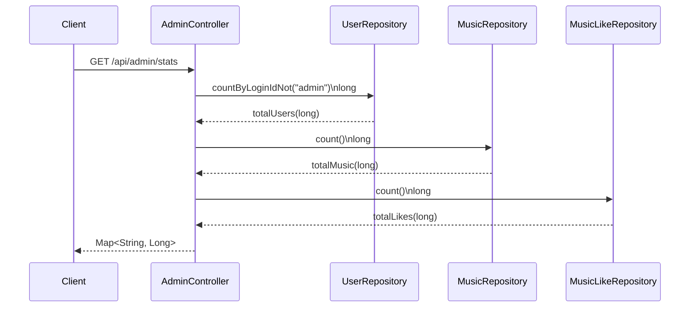
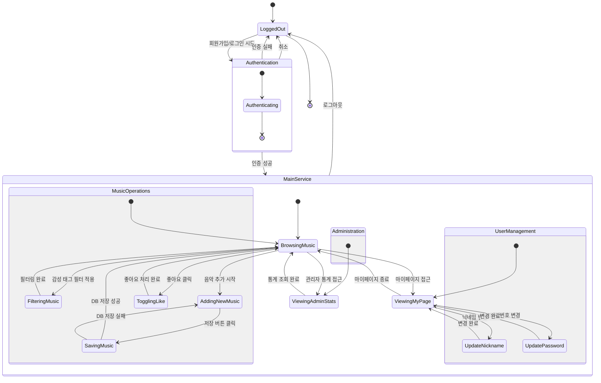

# Design 
22212010 김령하
## 🎵 My Mood, My Music (M3) 🎵 

## [ Revision history ]

| Revision date | Version # | Description | Author |
| :--- | :--- | :--- | :--- |
| 2026.06.03 | 1.0.0 | Design Document | 김령하 |

---

## = Contents =

1. Introduction
2. Class Diagram
3. Sequence Diagram
4. State Machine Diagram
5. Implementation Requirements
6. Glossary
7. References

---

## 1. Introduction

### 1) Executive Summary
현대사회에서 음악은 우리 일상생활에 없어서는 안 될 요소로 확고히 자리 잡았다. 
주변을 둘러보면 길거리 카페, 상점, 공공장소 등 다양한 공간을 음악이 채우고 있으며, 외출 준비나 출퇴근 중에 음악을 듣는 것은 우리 일상의 자연스러운 일부가 되었다. 
우리가 좋아하는 음악 유형은 날씨나 개인 기분과 같은 요인에 따라 매일 달라지며, 음악은 우리의 감정과 경험을 표현하고 위안을 주는 객관적인 매체 역할을 한다.
하지만 대형 스트리밍 플랫폼들이 제공하는 추천 알고리즘은 주로 사용자의 장기적인 청취 이력이나 대중적인 차트 순위를 기반으로 한다. 
그렇다 보니 제한된 시간 속에서 '지금 당장' 내가 느끼는 기분이나 상황에 딱 맞는 노래를 찾기란 여간 번거로운 일이 아니다. 
방대한 음악의 다양성 속에서 오히려 원하는 스타일을 찾기 어려워하는 이 부분에 바로 맞춤형 솔루션이 필요했다.
이러한 불편함을 해소하기 위해, 개인의 취향과 현재 감정에 맞는 음악을 쉽게 찾을 수 있도록 돕는 유튜브 기반의 태그형 맞춤 음악 큐레이션 웹 서비스 'My Mood, My Music (M3)'를 기획하게 되었다. 
이 시스템의 첫 번째 목표는 '효율적이고 즉각적인 감성 맞춤 큐레이션'이다. 
기존 플랫폼의 한계를 벗어나 사용자가 직접 유튜브 링크와 감성 태그를 등록하고, 직관적인 태그 필터를 통해 지금 기분에 맞는 플레이리스트만 즉시 뽑아볼 수 있게 한다. 
두 번째 목표는 '음악을 통한 소셜 네트워킹'이다. 혼자 듣는 것을 넘어 메인 화면의 '모두의 플레이리스트'에 공유하고, 타인의 곡에 좋아를 누르며 취향을 교류하게 한다. 
이 기능을 통해 사용자는 항상 자신의 감정을 표현하는 데 적합한 완벽한 사운드트랙으로 일상을 풍요롭게 하고, 새로운 스타일을 발견하며 청각적 지평을 넓힐 수 있을 것이다.

### 2) Describe the features of project
M3 시스템은 클라이언트와 서버 간의 역할을 명확히 분리하여 효율적인 관리를 도모하며, 구현될 주요 기능은 다음과 같다.
* **회원 관리 기능:** 사용자는 아이디, 비밀번호, 닉네임을 통해 가입 및 로그인을 할 수 있으며, 마이페이지를 통해 언제든 개인정보를 수정할 수 있다.
* **유튜브 기반 음악 등록 기능:** 유튜브 영상의 링크와 현재 감정을 나타내는 태그를 입력하면, 시스템이 자동으로 영상 메타데이터를 추출하여 서버에 저장한다.
* **태그 필터링 및 탐색 기능:** 메인 화면에서 원하는 감성 태그 버튼을 클릭하면 전체 목록 중 해당 태그와 일치하는 곡들만 즉각적으로 필터링되어 나타난다.
* **좋아요 토글 기능:** 타인이 올린 소셜 플레이리스트를 구경하다가 마음에 드는 곡이 있으면 하트를 눌러 찜할 수 있으며, 이 기록은 마이페이지의 '내가 찜한 플레이리스트'에서 따로 모아볼 수 있다.
* **관리자 통계 대시보드:** 관리자 역할을 하는 Admin 계정은 전체 가입자 수, 누적 등록 음악 수, 총 좋아요 수 등의 통계를 실시간으로 확인하여 시스템의 활성도를 효율적으로 파악할 수 있다.

---

## 2. Class Diagram

아래 그림은 M3 시스템의 정적인 구조와 객체 간의 관계를 보여주는 Class Diagram이다.

본 시스템은 객체지향 설계 원칙과 MVC 아키텍처 패턴에 입각하여 설계되었다. 
크게 사용자 계정 관리를 담당하는 User 도메인과 음악 및 좋아요 기능을 담당하는 Music 도메인으로 분리되어 있으며, 외부 API 통신을 위한 외부 연동 전용 Service 클래스가 포함되어 시스템의 결합도를 낮추었다. 
주요 클래스에 대한 상세한 설명은 아래 표와 같다.

| 클래스명 | 상세 설명 |
| :--- | :--- |
| **UserController** | 클라이언트로부터 들어오는 회원가입, 로그인, 개인정보 수정(닉네임/비밀번호)과 관련된 모든 HTTP 통신 요청을 매핑하고 가공하여 응답하는 프론트 엔드포인트 역할을 담당한다. 전달받은 DTO 객체를 검증하고 처리 결과에 따라 적절한 상태 코드를 반환한다. |
| **UserService** | 애플리케이션의 핵심 비즈니스 로직을 수행하는 계층이다. 사용자 회원가입 시 아이디 및 닉네임의 중복 여부를 판별하고, 로그인 시 안전한 비밀번호 대조 작업을 수행한다. 또한 데이터베이스의 트랜잭션을 관리하여 데이터의 무결성을 유지하는 중추적인 역할을 한다. |
| **UserRepository** | 실제 데이터베이스의 USERS 테이블과 직접 접근하여 사용자 데이터를 다루는 영속성 계층이다. Spring Data JPA 등을 활용하여 사용자 정보의 저장, 단일 조회(findByLoginId), 조건부 조회 등의 쿼리 메서드를 실행한다. |
| **MusicController** | 사용자의 새로운 음악 저장 요청, 전체 소셜 음악 목록 및 개인 보관함 목록 조회 요청, 음악에 대한 좋아요 토글 요청 등 음악 서비스 전반의 API 라우팅을 담당하는 컨트롤러이다. |
| **YouTubeService** | 외부 시스템인 YouTube Data API v3와의 통신을 전담하는 외부 연동 전용 서비스 클래스이다. 컨트롤러로부터 Video ID를 전달받아 외부 서버에 HTTP GET 요청을 보내고, 응답받은 JSON 데이터에서 영상의 제목과 썸네일 정보만을 정제하여 내부 시스템으로 전달한다. |
| **MusicRepository** | 사용자가 플랫폼에 등록한 유튜브 음악의 메타데이터(Video ID, 제목, 태그, 등록자 정보 등)를 MUSIC 테이블에 반영하고 조건별로 데이터를 가져오는 인터페이스 역할을 한다. |
| **MusicLikeRepository** | 특정 사용자가 어떤 음악 카드에 '좋아요'를 눌렀는지에 대한 매핑 정보를 삽입하거나 삭제하는 역할을 수행하여 개인화된 선호 데이터를 관리한다. |
| **AdminController** | 일반 사용자가 아닌 관리자 권한을 가진 사용자만이 접근할 수 있는 통계 기능 전용 컨트롤러이다. 시스템 운영 현황 파악을 위해 여러 Repository를 복합적으로 호출하여 집계 데이터를 생성한다. |

## 3. Sequence Diagram

### 3.1. 회원가입 및 로그인 흐름 
이 시퀀스는 사용자가 시스템에 안전하게 접근하기 위한 가장 기본적인 인증/인가 과정을 보여준다. 
회원가입 시 UserController가 클라이언트의 가입 정보(DTO)를 받아 UserService로 넘기면, 서비스 계층에서는 DB를 통해 아이디와 닉네임의 중복 여부를 순차적으로 꼼꼼하게 검증하여 모두 통과해야만 새로운 User 객체를 저장한다. 
로그인 과정의 경우, 클라이언트가 제출한 아이디를 기준으로 DB를 먼저 조회하고 객체가 존재할 시에만 비밀번호 일치 여부를 대조하며, 불일치 시 401(UNAUTHORIZED) 또는 400 상태 코드와 함께 즉시 오류를 반환하여 보안성을 엄격하게 유지한다.

### 3.2. 회원 정보 수정 흐름 
로그인된 사용자가 마이페이지에서 자신의 프로필(닉네임, 비밀번호)을 수정할 때 발생하는 일련의 데이터베이스 트랜잭션 흐름을 나타낸다. 
클라이언트로부터 PUT 요청이 들어오면, 시스템은 우선 세션 식별자에 해당하는 사용자가 DB에 존재하는지 무결성을 확인한다.
이후 닉네임 변경 시에는 타 사용자와의 중복 여부를, 비밀번호 변경 시에는 입력한 '현재 비밀번호'가 기존 DB 데이터와 일치하는지를 검증하고 통과 시에만 상태를 업데이트하여 잘못된 정보 수정을 원천적으로 차단한다.

### 3.3. 유튜브 API 연동 및 음악 저장 흐름 
사용자가 입력한 유튜브 링크에서 추출한 Video ID를 바탕으로 M3 플랫폼에 새로운 음악 객체를 생성하는 가장 핵심적인 통신 흐름이다.
MusicController는 YouTubeService를 호출하여 외부 API로 GET 요청을 전송하고, 반환된 영상의 메타데이터를 사용자가 선택한 감성 태그와 결합해 DB에 저장한다. 
반면, 영상이 삭제되었거나 API 호출 한도가 초과하는 등 외부 오류가 발생하면 즉시 예외를 던져 프론트엔드에 500 에러를 반환하고 DB 저장을 롤백하는 안정적인 처리 로직을 가진다.

### 3.4. 음악 목록 조회 흐름 
시스템에 등록되어 영속화된 음악 데이터를 클라이언트의 뷰 화면에 렌더링하기 위해 서버로 목록 조회를 요청하는 흐름이다. 
메인 홈 화면에서는 `/api/music/all` 엔드포인트를 통해 시스템에 쌓인 모든 사용자의 소셜 음악 데이터를 조회한다. 
반면 마이페이지에서는 로그인 아이디를 파라미터(`?loginId=`)로 포함시켜 호출하며, Repository의 `findAllByLoginId` 메서드를 통해 해당 조건에 부합하는 음악 엔티티들만 필터링한 후 시간순으로 정렬된 JSON 배열 형태로 클라이언트에게 반환한다.

### 3.5. 음악 좋아요 토글 흐름 
특정 음악에 대한 사용자의 긍정적인 반응인 '좋아요' 상태를 실시간으로 변경하는 흐름이다. 
이 기능은 단순히 데이터를 추가하는 것이 아니라 상황에 맞게 스위치처럼 작동하는 토글 로직을 채택했다. 
MusicLikeRepository는 교차 테이블에 기록이 이미 존재하는지 검사하여, 존재한다면 사용자가 다시 클릭한 것이므로 레코드를 삭제하고, 없다면 새로운 엔티티를 생성하여 저장함으로써 데이터 중복 적재를 막고 무결성을 유지한다.

### 3.6. 관리자 시스템 통계 집계 흐름 
관리자 권한을 지닌 특수 계정이 운영 현황을 모니터링하기 위해 대시보드 통계 지표를 수집하는 백엔드 데이터 집계 흐름이다.
AdminController는 복합적인 지표를 완성하기 위해 여러 Repository를 연속적으로 호출합니다. 
어드민 계정을 제외한 실제 서비스 가입 유저 수, 전체 등록된 음악 수, 총 발생한 하트 수를 각각 병렬적으로 집계한 뒤, 이 숫자 데이터를 하나의 Map 자료구조로 래핑하여 프론트엔드의 대시보드 UI로 반환한다.

---

## 4. State Machine Diagram

M3 애플리케이션에 처음 접속하는 순간부터 음악 탐색, 필터링, 새로운 곡 저장, 좋아요 반영, 그리고 관리자 화면 확인까지 사용자가 서비스 내에서 경험하게 되는 전반적인 상태 변화와 논리적인 흐름을 시각화한 다이어그램이다.
전체 흐름의 복잡성을 줄이고 직관성을 높이기 위해, 유사한 목적을 가진 기능별로 구역을 나누는 그룹화 기법을 활용하여 체계적으로 설계한다.

### 4.1. 상태 상세 설명

#### 1) 초기 상태 (Entry Point)
* **LoggedOut**: 애플리케이션에 접속한 직후의 초기 상태이자 비로그인 상태이다. 서비스의 어떤 주요 기능도 열람할 수 없으며 오직 로그인 및 회원가입 화면만이 노출된다.

#### 2) 인증 및 보안 그룹 (Authentication)
* **Authenticating**: 회원가입 폼을 작성하여 제출하거나 아이디/비밀번호를 입력하여 로그인을 처리 중인 과도기적 상태이다.
  * **성공**: 내부 인증 로직을 무사히 통과하면 메인 서비스 화면으로 진입 권한을 부여받는다.
  * **실패 또는 취소**: 데이터베이스에 일치하는 정보가 없거나 중복이 발생하는 등 인증 로직을 통과하지 못하면, 예외 처리 후 다시 초기 비로그인 상태로 되돌아간다.

#### 3) 메인 서비스 그룹 (MainService)

**[음악 관리 서브그룹 - MusicOperations]**
* **BrowsingMusic**: 사용자가 홈 화면에 진입하여 등록된 전체 소셜 음악 목록을 자유롭게 스크롤하며 탐색하는 가장 베이스가 되는 상태이다.
* **FilteringMusic**: 기쁨, 슬픔, 휴식 등 자신이 원하는 분위기의 감성 태그 버튼을 클릭하여 전체 데이터 중 특정 속성값에 맞는 음악만을 화면에 동적으로 필터링해 내는 렌더링 상태이다.
* **AddingNewMusic**: 새로운 유튜브 링크와 감성 태그 값을 입력하거나 선택하며 등록을 준비하는 폼 작성 상태이다
* **SavingMusic**: 사용자가 기입한 정보를 바탕으로 외부 YouTube API와 통신하여 데이터를 받아오고, 이를 서비스의 내부 DB에 영구적으로 저장 처리하는 런타임 상태이다.
  * **성공**: 모든 저장 절차가 완료되면 즉시 음악 탐색 상태로 복귀하며, 화면은 새로고침되어 추가된 음악 카드가 렌더링된다.
  * **실패**: 네트워크 에러, 잘못된 Video ID 등으로 처리가 실패할 경우 예외 경고창을 띄운 후 음악 추가 입력 폼 상태로 되돌려 사용자의 재시도를 유도한다.
* **TogglingLike**: 음악 카드에 부착된 하트 아이콘을 눌러 좋아요 데이터를 추가하거나 삭제하는 백그라운드 DB 통신 상태이며, 통신이 종료되면 즉각 탐색 상태로 복귀한다.

**[사용자 관리 서브그룹 - UserManagement]**
* **ViewingMyPage**: 개인 프로필 정보를 열람하고 자신이 지금까지 업로드한 곡과 하트를 누른 플레이리스트를 독립적인 공간에서 확인하는 마이페이지 조회 상태이다.
* **UpdateNickname / UpdatePassword**: 마이페이지 내부에서 사용자의 식별 정보인 닉네임과 접근 보안 정보인 비밀번호를 새로운 값으로 덮어쓰기 위해 검증을 거치는 상태이다. 

**[시스템 관리 그룹 - Administration]**
* **ViewingAdminStats**: 관리자 권한을 가진 특수 사용자 계정만이 진입할 수 있는 상태로, 데이터베이스에 누적된 시스템의 전체 통계 데이터(가입자, 곡 수, 좋아요 수)를 차트나 대시보드 카드로 한눈에 모니터링하는 상태이다. 일반 유저 접근 시 강제로 이전 상태로 튕겨낸다.

## 5. Implementation Requirements

본 시스템을 원활하게 구현하고 테스트하기 위한 물리적 및 소프트웨어적 요구사항이다.

### 5.1. H/W platform requirements
* **CPU**: Intel Core i5 프로세서 또는 그 이상 (동등 성능의 AMD 프로세서 호환)
* **RAM**: 최소 8GB 이상 권장
* **Storage**: 최소 10GB 이상의 여유 공간 확보 (DB 및 로그 데이터 적재용)
* **Network**: 지속적인 인터넷 연결 필수 (YouTube Data API v3 통신을 위해 외부망 접속 필요)

### 5.2. S/W platform requirements
* **OS**: Microsoft Windows 10/11 또는 macOS 11 이상
* **Web Browser**: Google Chrome 최신 버전 권장
* **Frontend**: React.js, Node.js 기반 런타임 환경
* **Backend**: Java 17 이상, Spring Boot 프레임워크
* **Database**: MySQL 8.0 이상 (또는 로컬 테스트용 H2 In-memory DB)
* **API**: YouTube Data API v3 Key 발급 및 환경 변수 설정 필요

---

## 6. Glossary

| 용어 | 설명 |
| :--- | :--- |
| **큐레이션(Curation)** | 무수히 많은 정보 중 콘텐츠 목적에 따라 분류하고, 가치 있는 것을 선별하여 제공하는 서비스. |
| **Video ID** | 유튜브 영상 URL(v= 파라미터)에 포함된 11자리의 고유 식별자. 사용자가 입력한 링크에서 시스템이 자동으로 추출하여 외부 API 통신에 사용한다. |
| **메타데이터(Metadata)** | 다른 데이터를 정의하고 기술하는 데이터. 시스템 내에서는 영상 제목과 썸네일 URL을 가리킨다. |
| **썸네일(Thumbnail)** | 웹 페이지 레이아웃 규격에 맞춰 축소된 형태의 영상 미리보기 이미지. |
| **토글(Toggle)** | 하나의 조작으로 두 가지 상태(저장/삭제)를 번갈아 가며 전환하는 인터페이스 제어 방식. |
| **렌더링(Rendering)** | 서버로부터 받아온 데이터를 사용자가 시각적으로 확인할 수 있도록 브라우저 화면에 그려내는 과정. |
| **영속성(Persistence)** | 서버가 종료되거나 재시작되더라도, 사용자가 등록한 데이터가 소멸하지 않고 데이터베이스에 안전하게 유지되는 성질. |

---

## 7. References

1. Google Developers. "YouTube Data API v3 Overview and Reference"
2. 네이버 지식백과 (IT용어사전)
